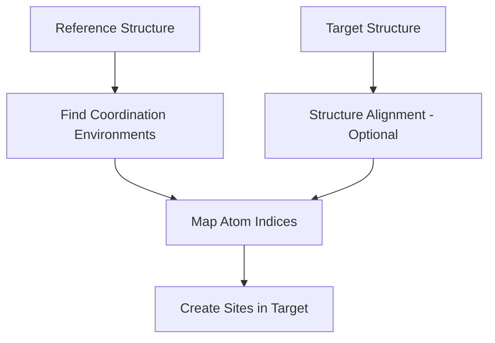

# The Reference-Based Sites Workflow

The Reference-Based Sites (RBS) workflow provides a powerful way to define sites in crystal structures based on coordination environments. This guide explains how the workflow operates and how to use it effectively.

## Overview

The RBS workflow simplifies site definition by allowing you to:
- Define sites based on coordination environments rather than absolute positions
- Transfer site definitions from an idealised reference structure to real structures
- Handle structural distortions and different ion populations
- Maintain consistency based on chemical environments

Most users interact with this workflow indirectly through the `TrajectoryBuilder` when creating polyhedral or dynamic Voronoi sites. Understanding how it works helps you make better choices when configuring the builder.

## How It Works

The RBS workflow follows these key steps:

1. **Structure Alignment** (optional): Finds the optimal translation to minimize the mismatch between structures (using specified species or all species)
2. **Environment Finding**: Identifies coordination environments in the reference structure
3. **Index Mapping**: Maps atom indices between structures, handling different atom counts
4. **Site Creation**: Creates sites in the target structure using mapped indices



## Using RBS Through the Builder

The most common way to use the RBS workflow is through the `TrajectoryBuilder`:

```python
# Define polyhedral sites using RBS workflow
trajectory = (TrajectoryBuilder()
    .with_structure(target_structure)
    .with_reference_structure(reference_structure)
    .with_mobile_species("Li")
    .with_structure_alignment(align=True, align_species=["O"])
    .with_site_mapping(mapping_species=["O"])
    .with_polyhedral_sites(
        centre_species="Li",
        vertex_species="O",
        cutoff=2.5,
        n_vertices=4,
        label="tetrahedral"
    )
    .build())
```

In this example:
- The builder uses RBS internally to find Li-centered tetrahedral sites
- Structure alignment uses O atoms as reference points
- Site mapping also uses O atoms to identify corresponding polyhedra
- Sites are created in the target structure based on mapped coordination

## Understanding the Components

### Structure Alignment

Structure alignment finds the optimal translation to minimize the mismatch between reference and target structures:

```python
builder.with_structure_alignment(
    align=True,              # Enable alignment
    align_species=["O"],     # Use O atoms for alignment
    align_metric='rmsd'      # Minimise RMSD
)
```

**How it works**:
- If `align_species` is specified: Aligns using only those species (must have same count in both structures)
- If `align_species` is None: Aligns using all species (structures must have identical stoichiometry)

**When to use**: 
- When structures have different coordinate origins
- When aligning structures with different mobile ion content (align on framework atoms)

**Note**: This only handles translation, not rotation or distortion.

### Site Mapping

Site mapping identifies corresponding sites between structures:

```python
builder.with_site_mapping(
    mapping_species=["O"]    # Use O atoms to map sites
)
```

**When to use**: When structures have different numbers of mobile ions but the same framework.

### Default Behaviours

The builder implements smart defaults:
- If you specify mapping species but not alignment species, mapping species are used for alignment
- If you specify alignment species but not mapping species, alignment species are used for mapping
- Alignment is enabled by default

## Advanced Usage: Direct RBS

For advanced users, you can use the RBS workflow directly:

```python
from site_analysis.reference_workflow import ReferenceBasedSites

# Create RBS instance
rbs = ReferenceBasedSites(
    reference_structure=reference_structure,
    target_structure=target_structure,
    align=True,
    align_species=["O"],
    align_metric='rmsd'
)

# Create polyhedral sites
sites = rbs.create_polyhedral_sites(
    center_species="Li",
    vertex_species="O",
    cutoff=2.5,
    n_vertices=4,
    label="tetrahedral",
    target_species=["O"]  # Species to map in target
)
```

## Common Patterns

### Idealised Reference with Real Target

The most common pattern uses an idealised structure as reference:

```python
# Load structures
ideal_structure = Structure.from_file("ideal_LiFePO4.cif")
md_structure = xdatcar.structures[0]

# Create trajectory using idealised reference
trajectory = (TrajectoryBuilder()
    .with_structure(md_structure)
    .with_reference_structure(ideal_structure)
    .with_mobile_species("Li")
    .with_polyhedral_sites(
        centre_species="Li",
        vertex_species="O",
        cutoff=2.5,
        n_vertices=4
    )
    .build())
```

### Different Ion Populations

Handle structures with different numbers of mobile ions:

```python
# Reference has all Li sites occupied, target has some vacancies
trajectory = (TrajectoryBuilder()
    .with_structure(partially_delithiated)
    .with_reference_structure(fully_lithiated)
    .with_mobile_species("Li")
    .with_structure_alignment(align=True, align_species=["O", "P"])  # Align on framework atoms
    .with_site_mapping(mapping_species=["O"])  # Map using framework
    .with_polyhedral_sites(
        centre_species="Li",
        vertex_species="O",
        cutoff=2.5,
        n_vertices=6
    )
    .build())
```

In this example, alignment works even though the structures have different Li content, because we align using the framework atoms (O and P) which have the same count in both structures.

### Framework-Based Alignment

For accurate site mapping, align using immobile framework atoms:

```python
trajectory = (TrajectoryBuilder()
    .with_structure(target)
    .with_reference_structure(reference)
    .with_mobile_species(["Li", "Na"])
    .with_structure_alignment(
        align=True,
        align_species=["Ti", "O"]  # Align on framework
    )
    .with_site_mapping(
        mapping_species=["O"]      # Map sites using oxygen positions
    )
    .with_polyhedral_sites(
        centre_species="Li",
        vertex_species="O",
        cutoff=3.0,
        n_vertices=6
    )
    .build())
```

## When to Use Reference-Based Sites

The RBS workflow is particularly useful when:

1. **You have an idealised reference structure** with well-defined coordination environments
2. **Target structures are distorted** but maintain the same topology
3. **Ion populations vary** between structures
4. **You want consistent site definitions** across multiple structures

## Best Practices

1. **Choose appropriate reference structures**:
   - Use idealised structures with regular coordination
   - Ensure the reference has all possible site types

2. **Select alignment species carefully**:
   - Use framework atoms that move minimally
   - Avoid using mobile species for alignment

3. **Match mapping species to site definition**:
   - For polyhedral sites, mapping species should match vertex species
   - For dynamic Voronoi sites, mapping species should match reference species

4. **Handle edge cases**:
   - Check for successful site creation (builder will raise errors if none found)
   - Verify alignment quality by visualising aligned structures

## Understanding Coordination Environments

The RBS workflow finds coordination environments based on:

```python
# These parameters in with_polyhedral_sites():
centre_species="Li"    # Central atom species
vertex_species="O"     # Coordinating atom species
cutoff=2.5            # Maximum distance for coordination
n_vertices=4          # Exact number of coordinating atoms
```

The workflow finds all Li atoms with exactly 4 O atoms within 2.5 Å in the reference structure, then maps these to equivalent environments in the target.

## Troubleshooting

### No sites found
```python
# ValueError: No polyhedral sites found for centre_species='Li', 
# vertex_species='O', cutoff=2.5, n_vertices=4. Try adjusting 
# these parameters or verify that the specified species exist in the structure.
```
**Solutions**:
- Adjust cutoff distance
- Check n_vertices matches actual coordination
- Verify species exist in structures
- Check structure alignment succeeded

### Alignment optimization failure
```python
# ValueError: Optimization failed: [optimizer message]
```
**Solutions**:
- Check that structures are related (not completely different materials)
- Verify alignment species are present in both structures
- Try different alignment species

### Mapping violations
```python
# ValueError: 1:1 mapping violation: Multiple reference atoms map to 
# the same target atom(s) at indices [5, 12]
```
**Solutions**:
- Use different mapping species
- Ensure structures have compatible topologies
- Check for duplicate atoms or overlapping positions

### Structure compatibility issues
```python
# ValueError: Different number of O atoms: 24 in reference vs 20 in target
```
**Solutions**:
- Use species that have the same count in both structures
- For different compositions, align and map using framework atoms only

### Alignment quality
After successful alignment, check the quality metrics:
```python
# When using RBS directly, you can access:
# rbs.alignment_metrics['rmsd']  # Check if this is reasonable
# rbs.alignment_metrics['max_dist']
```
**Solutions** for high RMSD:
- Verify structures are actually related
- Use more representative alignment species
- Check for significant structural distortions
